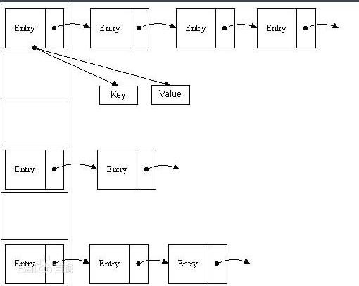
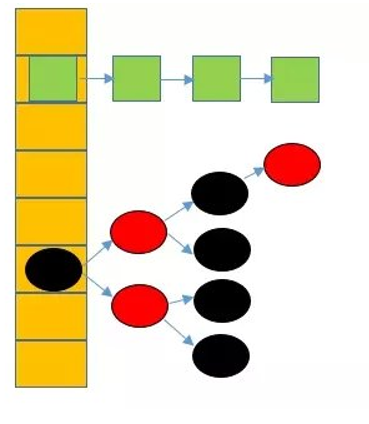

#Collection集合
## List
- 特点
    - 可重复
    - 有序的
    - 支持迭代器
    
>列表的代表子类有哪些
>>List<>是一个接口，其中继承这个接口的两个子类分别是ArrayList和LinkList类

### ArrayList
>是一个数组类型的列表，具有查询快，增删慢的特点

### LinkList
>是一个链表类型的列表，具有增删快，查询慢的特点。

## Set
- 不重复
- 无序
- 只能使用增强for循环迭代数据
- 线程不安全的
### HashSet
> 由哈希表实现的Set接口，只能保障数据的不重复性，并且处于无序状态。
### LinkedHashSet
>哈希表和链表实现的set接口，具有可预测的迭代次序，
>由**链表**保障元素的有序性，也就是说元素的取出顺序和存储顺序是一致的
>由哈希表保障set的不可重复性。
### TreeSet
> 哈希表和数组实现的set接口，具有自动排序的迭代次序
> 由数组保障元素的有序性，treeset(comparator comparator)可以自定义排序功能
> 由哈希表保障元素的不可重复性

## 泛型和可变参数
>什么是泛型？
>>泛型就是可以不用再类中指定对应的类型，根据前端的输入来决定对象的类型。

>有什么好处呢？
>> 1. 使某个变量的类型应用更加灵活。 
>> 2. 安全：有了泛型，在编译期间就可以避免不符合类型的数据赋值。 
>> 3. 避免数据类型转换。

>什么是可变参数？
>> 可以在创建对象时输入不限制数量的参数个数，原理是将输入的参数，转变为数组，传入方法中。

>有什么好处呢？
>> 涉及到输入多参数对象时，可以不用再重写多个方法，简化开发代码。

## Map
### HashMap
原文文档:https://www.cnblogs.com/xiaoxi/p/7233201.html
>在JDK1.8之前，HashMap采用数组+链表实现，即使用链表处理冲突，同一hash值的节点都存储在一个链表里。但是当位于一个桶中的元素较多，即hash值相等的元素较多时，通过key值依次查找的效率较低。
>而JDK1.8中，HashMap采用数组+链表+红黑树实现，当链表长度超过阈值（8）时，将链表转换为红黑树，这样大大减少了查找时间。

jdk1.8之前的hashmap都采用上图的结构，都是基于一个数组和多个单链表，hash值冲突的时候，就将对应节点以链表的形式存储。如果在一个链表中查找其中一个节点时，将会花费O（n）的查找时间，会有很大的性能损失。到了jdk1.8，当同一个hash值的节点数不小于8时，不再采用单链表形式存储，而是采用红黑树，如下图所示。

说明：上图很形象的展示了HashMap的数据结构（数组+链表+红黑树），桶中的结构可能是链表，也可能是红黑树，红黑树的引入是为了提高效率。
### LinkedHashMap
- LinkedHashMap是否允许空	Key和Value都允许空
- LinkedHashMap是否允许重复数据	Key重复会覆盖、Value允许重复
- LinkedHashMap是否有序	有序
- LinkedHashMap是否线程安全	非线程安全

## 并发修改异常
>在List/Set/Map中在通过迭代器读取时，对集合中的元素进行**增删改**操作时，会出现并发修改异常。
> 这是因为在源码中对保存两个元素，分别是预期修改次数expectedModCount和实际修改次数ModCount
> 并在新增，删除，修改时将两个参数进行比对。不相等则排出并发修改异常。

>List可以通过iterator子类中的add方法进行回避并发修改异常

