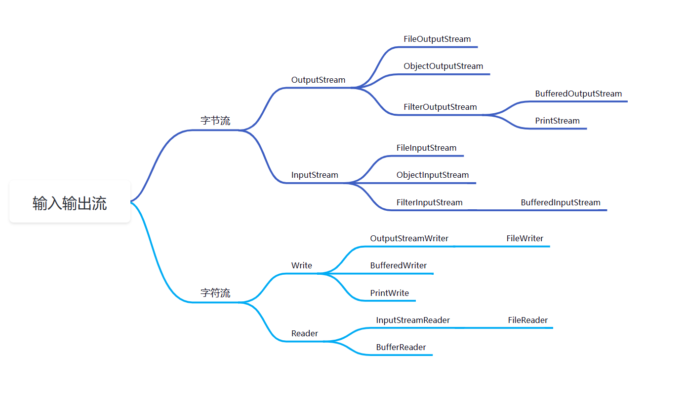
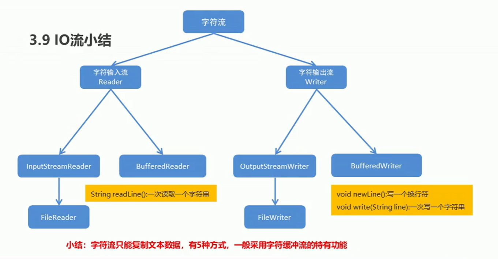

# File
## File的三种初始化
## File的创建功能

# 输入输出流

## 字节输入输出流

>什么是字节流？
>> 字节流-传输过程中，传输数据的基本单位时字节的流

代码示例：ioByteStreamDemo/IOFileStram.java

## 字符输入输出流

代码示例：ioStringStreamDemo/IOStringDemo.java
练习1：复制文件操作
练习2：复制文件夹下面的所以文件到模块目录下
练习3：复制文件夹下面的多级文件夹和文件到模块目录下

## 打印输入输出流
### 字节打印流
代码示例：ioStringStreamDemo/IOStringDemo.java
练习1：ioStringStreamDemo/Practice.java
### 字符打印流
代码示例：ioStringStreamDemo/IOStringDemo.java
练习1：ioStringStreamDemo/Practice.java

## 对象序列化
代码示例：ObjectSerializationDemo/ObjectSerializationDemo.java

## ProPerties与File输入输出流联用
代码示例：PropertiesAndFileIODemo/PropertiesAndFileIODemo.java
练习1：PropertiesAndFileIODemo/Practice.java